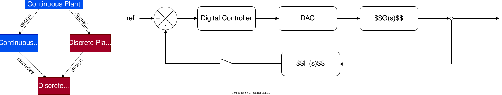
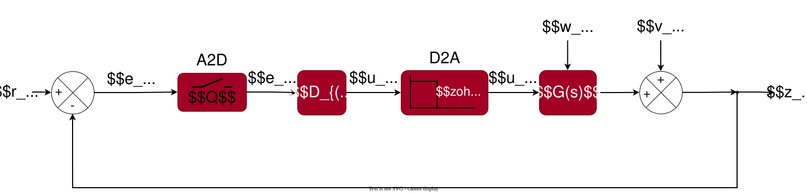

Computer monitoring of real-time systems requires analog-to-digital (A2D) and digital-to-analog (D2A) conversion.

## Control Design


> If sampling is so much faster than the plant process, we can skip the discretization

## Discrete-time state-space models

Linear discrete-time systems can also be represented in state-space form:
$$x_{k+1}=A_dx_k+B_du_k+w_k$$
$$z_k=C_dx_k+D_du_k+v_k$$
> The subscript $d$ is used to remember that matrices $A$, $B$, $C$, and $D$ are different.

The full solution expands to
$$x_k=A_d^kx_0+\sum_{j=0}^{k-1}A_d^{k-1-j}B_du_j$$
Where:
- $\sum_{j=0}^{k-1}A_d^{k-1-j}B_du_j$ is the convolution
Then
$$z_k=C_dA_d^kx_0+\sum_{j=0}^{k-1}C_dA_d^{k-1-j}B_du_j+D_du_k$$
Where:
- $C_dA_d^kx_0$ is the initial response
- $\sum_{j=0}^{k-1}C_dA_d^{k-1-j}B_du_j$ is the convolution (the accumulated effects from previous inputs)
- $D_du_k$ is the feedthrough (current input effects)

## Converting plant dynamics


Then, by using integrator factor method we get
$$\dot{x}(t)=Ax(t)+Bu(t)\rightarrow\frac{d}{dt}\left(e^{-At}x(t)\right)=e^{-At}Bu(t)$$
$$x(t)=e^{At}x_0+\int_0^{t}e^{A(t-\tau)}Bu(\tau)d\tau \ \ \ \ \ \text{eq}(1)$$ 
> We will assume that $x_0 = 0$ then $x(t)=\int_0^{t}e^{A(t-\tau)}Bu(\tau)d\tau$ 

Now, by substituting:
$$t=(k+1)\Delta t$$
$$x_{k+1}=x\left(\left(k+1)\right)\Delta t\right)=\int_0^{\left(\left(k+1)\right)\Delta t\right)}e^{A(\left(\left(k+1)\right)\Delta t\right)-\tau)}Bu(\tau)d\tau$$
Now by splitting the integral range from $0\rightarrow k\Delta t$ and $k\Delta t\rightarrow (k+1)\Delta t$
$$x_{k+1}=e^{A\Delta t}\int_0^{k\Delta t}e^{A(k\Delta t-\tau)}Bu(\tau)d\tau +\int_{k\Delta t}^{\left(\left(k+1)\right)\Delta t\right)}e^{A(\left(\left(k+1)\right)\Delta t\right)-\tau)}Bu(\tau)d\tau $$
If pay attention:
- $\int_0^{k\Delta t}e^{A(k\Delta t-\tau)}Bu(\tau)d\tau$ has the same shape than $\text{eq(1)}$, therefore this term can be thought as $x(k\Delta t)$
$$x_{k+1}=e^{A\Delta t}x(k\Delta t) +\int_{k\Delta t}^{\left(\left(k+1)\right)\Delta t\right)}e^{A(\left(\left(k+1)\right)\Delta t\right)-\tau)}Bu(\tau)d\tau $$
Now using change of variable:
$$\sigma=(k+1)\Delta t - \tau$$
$$d\sigma = -d \tau$$
And updating the integral limits:

| $\tau$                 | Eval                                   | Limit             |
| ---------------------- | -------------------------------------- | ----------------- |
| $\tau =k \Delta T$     | $\sigma=(k+1)\Delta t - k \Delta T$    | $\sigma=\Delta t$ |
| $\tau =(k+1) \Delta T$ | $\sigma=(k+1)\Delta t - (k+1)\Delta t$ | $\sigma=0$        |
> We can assume that $u(k\Delta t)$ will remain constant in the integration period 

Then the integral
$$\int_{k\Delta t}^{\left(\left(k+1)\right)\Delta t\right)}e^{A(\left(\left(k+1)\right)\Delta t\right)-\tau)}Bu(\tau)d\tau \rightarrow -\left[\int_{\Delta t}^{0}e^{A\sigma}Bd\sigma\right] u(k\Delta t) = \left[\int_{0}^{\Delta t}e^{A\sigma}Bd\sigma\right] u(k\Delta t)$$
Finally:
$$x_{k+1}=e^{A\Delta t}x(k)+\left[\int_{0}^{\Delta t}e^{A\sigma}Bd\sigma\right] u(k)$$
Then:
- $A_d=e^{A\Delta t}$
- $B_d =\int_{0}^{\Delta t}e^{A\sigma}Bd\sigma$
>Matrices $C_d$,  $D_d$ don't need any transformation
### Computing matrices

| Matrix                                    | Hand method                                                               | Octave/Matlab                    |
| ----------------------------------------- | ------------------------------------------------------------------------- | -------------------------------- |
| $A_d=e^{A\Delta t}$                       | $\mathcal{L}^{-1}\left[\left(sI-A\right)^{-1}\right] \Big\|_{t=\Delta t}$ | `expm(A*dT)`                     |
| $B_d=\int_0^{\Delta t}e^{A\sigma}d\sigma$ | $A^{-1}\left(A_d-I\right)B$                                               | `int(expm (A* sigma ),0 , dT)*B` |
> You can obtain both $A_d$ and $B_d$ using 
```octave
sys_c = ss(A, B, [], []);  
c2d(sys_c,dT)
```

