## Model-based state estimation

Kalman Filters use sensed measurements and a mathematical model of a dynamic system to estimate its internal hidden state.

A *model* of the system and its state dynamics is assumed to be known

A system’s *state* is a vector of values that completely summarizes the effects of the past on the system.

Measured Output and Predicted Output should be similar

## Why do we need a model?
- We **cannot generally measure the state** of a dynamic system directly. Even when we can, we often choose not to do so because it is too expensive or too complex.
	- Instead, we measure the system input and then propagate those measurements through the model, updating the model’s prediction of the true state.
	- We make measurements that are linear or nonlinear functions of the state variables.
	- The measured and predicted outputs are compared.
	- The KF is an algorithm that updates the model’s state estimate using this prediction error as feedback regarding the quality of the present state estimate.

## Models
### Standard Discrete-time linear state-space model

Process/state equation
$$x_{k+1}=Ax_{k}+Bu_k+w_k$$
Output/measurement equation
$$z_k = Cx_k+Du_k+v_k$$
Where:
- $x$ is the state
- $u$ is the input
- $w$ is the process noise, disturbance
- $v$ is the measurement noise
- $z$ is the **sensor measurement**
#### Steps in a Kalman filter
1. Predict
   $$\hat{x}_k^-=A\hat{x}^+_{k-1}+Bu_{k-1}$$
   Where:
	- $\hat{x}_k^-$ is the prediction
	- $\hat{x}_k^+$ is the estimate
2. Estimate
   $$\hat{x}_k^+=\hat{x}^++L_{k}\left(z_k-\left(C\hat{x}_k^--Du_k\right)\right)$$
   Where:
	- $L_k$ is the gain factor **time variant**
	- $\left(C\hat{x}_k^--Du_k\right)$ Prediction about what will be
> We can use a confidence bounds ​ $\simeq3\sigma$
#### Non-linear
$$x_{k+1}=f\left(x_k,u_k,w_k\right)$$
$$z_{k+1}=h\left(x_k,u_k,v_k\right)$$
### Standard continuous-time linear state-space model
$$\dot{x}(t)=Ax(t)+Bu(t)+w(t)$$
$$z(t) = Cx(t)+Du(t)+v(t)$$
Where:
- $w(t) \in \mathbb{R}^n$  <ins>process noise</ins>. Notice that it affects the dynamics of the model by making **direct changes to the evolution** of $x(t)$
- $v(t)\in \mathbb{R}^m$ <ins>sensor noise</ins>. Notice that it **does not affect the dynamics of the model**; it affects only the measurement
- $x(t)\in\mathbb{R}^n,z(t)\in\mathbb{R}^m,v(t)\in\mathbb{R}^m$
- $A \in \mathbb{R}^{n\times n}$ <ins>system matrix</ins>. It models the evolution of the state in the absence of input. 
- $B \in \mathbb{R}^{n\times r}$  <ins>input matrix</ins>. It defines how linear combinations of $u(t)$ impact the evolution of the state.  
- $C \in \mathbb{R}^{m\times n}$ <ins>output matrix</ins>. It defines how the output depends on linear combinations of states.
- $D \in \mathbb{R}^{m\times r}$ <ins>feedforward (or feedthrough) matrix</ins>. It models how the output depends on linear combinations of the input (instantaneously).  

> Time-varying systems have $A, B, C, D$ that change with time.

## Kalman Filters as Sequential probabilistic inference
The Kalman Filter is special case of sequential probabilistic inference (SPI). Our goal is to estimate as best we can (in some sense) the values of state vector $x_k$ given all past and present input and output measurements $\mathbb{U}_k=\left\{u_0,u_1,\dots,u_k \right\}$ and $\mathbb{Z}_k=\left\{z_0,z_1,\dots,z_k \right\}$ respectively.

### What's a probabilistic inference?
A general type of state estimator, of which Kalman filter is a special case. The present state estimate is computed recursively based on the prior estimate and new input and output measurements.
